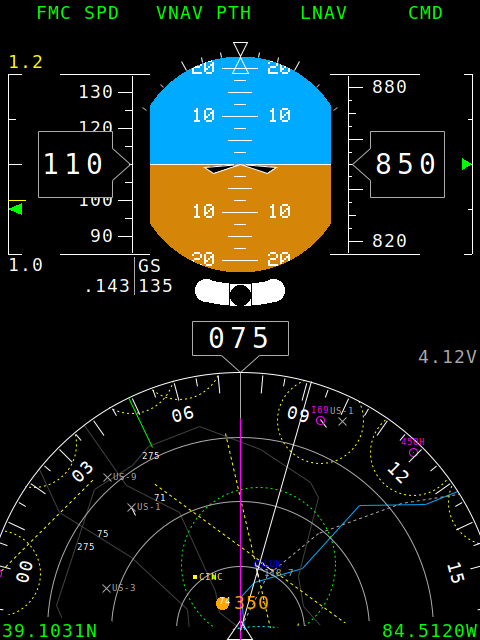
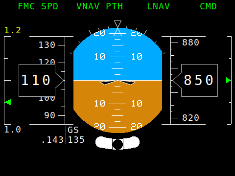
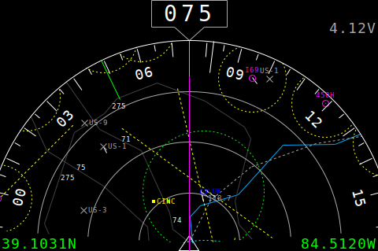
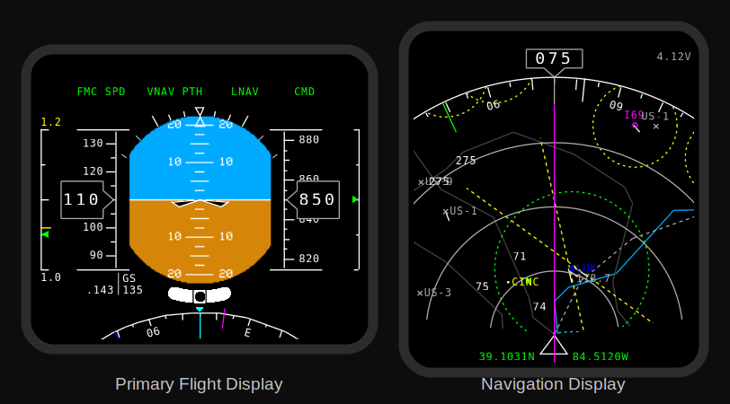
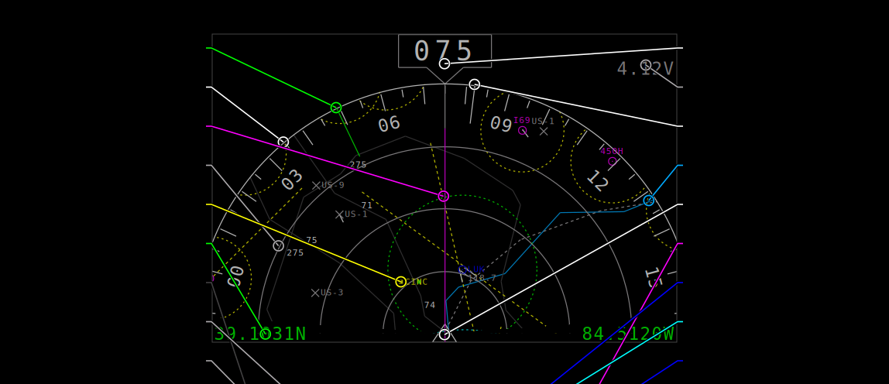

<div align="center">

# NanoPFD

**A pocket-sized glass cockpit — a Primary Flight Display + moving-map Navigation Display that runs on a single ESP32-S3 and a small Waveshare or LilyGO screen.**



</div>

NanoPFD turns a ~$15 ESP32-S3 dev display and a handful of I²C sensors into a self-contained
**EFIS** (Electronic Flight Instrument System): a real attitude indicator with airspeed and
altitude tapes on top, and a heading-up moving map of nearby airports, navaids and airspace
below — all rendered from scratch on the microcontroller, no PC or phone required.

> ⚠️ **Experimental / educational project.** NanoPFD is a hobby build, **not** a certified
> instrument. Do **not** rely on it for actual flight, navigation, or any safety-of-life use.

---

## What it shows

| Primary Flight Display | Navigation Display |
|:---:|:---:|
|  |  |

**PFD** — sky/ground attitude with a pitch ladder and bank scale, a fixed aircraft reference,
roll-stabilised airspeed (left) and altitude (right) tapes, digital heading, vertical-speed
indicator, a g-meter, and a turn-coordinator with slip/skid ball.

**ND** — a heading-up compass rose over a moving map: towered/non-towered airports, navaids,
runways, Class B/D and restricted airspace rings, rivers, coastlines, roads and state lines,
with decluttered labels — all centered on the live GPS position (with the last fix saved to
flash so it persists across power cycles).

On the single-screen boards both stack into one portrait panel (PFD on top, ND below); on the
dual-display board they drive two separate screens.

---

## One screen or two

The same renderer drives either a **single combined panel** or **two separate displays** —
just pick the board in [`config.h`](config.h):

<table>
<tr>
<td align="center" width="34%"></td>
<td align="center" width="66%"></td>
</tr>
<tr>
<td align="center"><sub><b>Single panel</b> — BOARD_C / BOARD_D<br/>PFD over ND on one screen</sub></td>
<td align="center"><sub><b>Dual display</b> — BOARD_A<br/>PFD and ND on two Waveshare 1.69″ screens</sub></td>
</tr>
</table>

---

## Reading the Navigation Display

The ND is a heading-up moving map. Every element is colour- and shape-coded the way a real
chart / EFIS is — here is everything on it (the picture is the actual rendered display over a
real map of the Philadelphia area, where the Delaware River doubles as the PA/NJ state line):

<div align="center">

</div>

**Compass &amp; own-ship**

| Element | Looks like | Meaning |
|---|---|---|
| Heading readout | white digits in a box (top) | current magnetic heading, tilt-compensated |
| Compass card | white ring, ticks every 5°, numbers every 30° | rotates so your heading is always **up** (heading-up) |
| Own-aircraft symbol | white triangle, fixed at the centre | you — the map moves underneath |
| Heading reference | magenta line up the middle | where the nose points (always straight up) |
| Ground track | white line from the aircraft to the rim | your actual course over the ground (differs from heading in a crosswind) |
| Bearing to home | green line + green dot | direction and range back to the saved home / takeoff point |
| Range rings | grey dotted rings at ¼ ½ ¾ | distance scale; the outer white ring is the selected map range |
| Remote ID traffic | orange dot + altitude in feet | a nearby aircraft/drone broadcasting FAA Remote ID — its position and altitude (Remote ID is capped at 400 ft AGL), **received live over Bluetooth + WiFi** (see below) |

**Airports &amp; navaids**

| Symbol | Looks like | Meaning |
|---|---|---|
| Towered airport | blue ○ with a centre dot | controlled field (has a control tower) |
| Non-towered airport | magenta ○ with a centre dot | uncontrolled field |
| Closed airfield | grey ✕ | decommissioned / abandoned |
| VOR / navaid | blue ◇ diamond | radio navigation aid |
| City / landmark | yellow ▪ square | town or reference point |
| Runway | short white line | drawn at the true runway heading |

**Airport &amp; airspace rings — the colour is the size / status**

| Ring colour | Meaning |
|---|---|
| Cyan | large airport |
| Green | medium airport |
| Yellow | small airport |
| Grey | closed airport |
| Red | restricted / prohibited airspace |

**Map geography**

| Line | Colour &amp; style |
|---|---|
| River / lake shore | light blue, solid |
| Coastline &amp; country border | tan, solid |
| Road / interstate / highway | dark grey, solid |
| State line | grey, dashed |
| Glide path | yellow, dashed |

**Text labels** — airport / navaid id with a grey frequency line below it (blue for towered
fields &amp; navaids, magenta for non-towered, grey for closed); city names in yellow; road
names in white.

**Status &amp; warnings (corners)**

| Indicator | Meaning |
|---|---|
| `lat / lon` (bottom) | map-centre position — **green** with a GPS fix, **grey** when coasting on the last fix |
| Battery voltage (top-right) | pack voltage — grey, turns **red** below 3.1 V |
| `SAT n` (top-right, yellow) | shown only when fewer than 5 satellites are tracked |
| `GPS LOST` box (grey, red outline) | the GPS fix was lost — the map freezes at the last known position (saved to flash, so it survives a power cycle) |

---

## Hardware

NanoPFD builds for three display configurations — pick one in [`config.h`](config.h) (set
exactly one of `BOARD_A` / `BOARD_C` / `BOARD_D` to `1`). All three use an ESP32-S3 with
**8 MB octal PSRAM + 16 MB flash** and the **same set of sensors**; only the screen(s) differ.

| Build | Display / MCU | Interface | Layout | Typical FPS |
|---|---|---|---|---|
| **BOARD_C** *(recommended)* | [Waveshare ESP32-S3-Touch-LCD-2.8B](https://www.waveshare.com/esp32-s3-touch-lcd-2.8b.htm) — 480×640 IPS (ST7701S) | RGB-parallel (LCD_CAM) | PFD + ND on one panel | ≈13 |
| **BOARD_D** | [LilyGO T4-S3](https://lilygo.cc/products/t4-s3) — 2.41″ 450×600 AMOLED (RM690B0) | QSPI | PFD + ND on one panel | ≈20 |
| **BOARD_A** | [Waveshare ESP32-S3-LCD-1.69](https://www.waveshare.com/esp32-s3-lcd-1.69.htm) (MCU + PFD, 240×280 ST7789) **+** [Waveshare 1.69″ LCD Module](https://www.waveshare.com/1.69inch-lcd-module.htm) (ND, ST7789V2) | dual SPI | PFD + ND on two screens | PFD ≈38 / ND ≈14 |

### Bill of materials

The **sensors are identical on every build** (all I²C / Qwiic, except the GPS, which is UART):

| Part | Role on the display | Where to buy | Approx. (USD) |
|---|---|---|---|
| [Adafruit BNO085](https://www.adafruit.com/product/4754) — 9-DOF fusion IMU | attitude (sky/ground), tilt-compensated heading, g-meter, turn coordinator | Adafruit #4754 | ~$25 |
| [Adafruit BMP390](https://www.adafruit.com/product/4816) — barometer | pressure altitude tape + vertical-speed indicator | Adafruit #4816 | ~$11 |
| [Matek ASPD-4525](https://www.mateksys.com/?portfolio=aspd-4525) — MS4525DO airspeed | airspeed tape — **kit includes the pitot tube, tubing &amp; cable** | MATEKSYS / FPV shops | ~$20 |
| [Matek SAM-M10Q](https://www.getfpv.com/mateksys-gnss-sam-m10q-gps-module-gallileo-glonass-beidoub1c.html) — u-blox M10 GPS (**UART**) | ND map centre, ground speed, ground track, lat/lon | MATEKSYS / FPV shops — JST-GH **UART** (the firmware talks UBX over a serial port, not I²C); any FPV u-blox M10 UART module works | ~$25 |
| Qwiic / STEMMA-QT cables + jumper wire | wiring the I²C bus + GPS UART | any | a few $ |

**…plus exactly one display configuration from the table above.**

> 💡 The Waveshare 1.69 and 2.8B boards already carry an onboard **QMI8658** 6-axis IMU, and
> the firmware can fall back to it (or to an **ICM-20948**). But the QMI8658 has no
> magnetometer, so the **BNO085 is strongly recommended** for a stable, tilt-compensated
> heading and a usable moving map.

*Prices are rough ballparks and exclude shipping — check the vendor for current pricing and stock.*

---

## How it works

NanoPFD is a from-scratch renderer tuned to squeeze a smooth glass cockpit out of a tiny MCU.

- **8-bit indexed canvases.** Everything draws into `GFXcanvas8`/`MyCanvas8` buffers using a
  12-entry colour palette ([`color_index[]`](InstrumentPanel.ino)) — half the memory of RGB565,
  and the per-board conversion to the panel's real format is cheap.
- **Two-core pipeline (FreeRTOS).** A sensor task publishes a lock-protected `state` snapshot;
  the PFD and ND draw + push their pixels in parallel on separate cores, double-buffered so the
  draw of one frame overlaps the transfer of the previous one.
- **A render path per panel kind:**
  - *SPI (BOARD_A)* — index→RGB565 converted on the fly during a DMA blit to each ST7789.
  - *RGB-parallel (BOARD_C)* — composited into a 600 KB RGB565 framebuffer that the S3's
    **LCD_CAM** peripheral scans out to the panel continuously.
  - *QSPI (BOARD_D)* — a self-contained RM690B0 driver pushes **RGB332** (1 byte/pixel) with a
    **per-line RLE codec** ([`RLE332.h`](RLE332.h), word-at-a-time run detection) so the frame
    compresses ~10× before the QSPI transfer.
- **Auto-generated aeronautical map.** [`tools/build_chart_data.py`](tools/build_chart_data.py)
  fetches OurAirports + Natural Earth data, simplifies it, assigns level-of-detail tiers, and
  emits [`chart_data.h`](chart_data.h). The renderer projects it equirectangularly, rotates it
  heading-up, and clips it to the compass circle — with range-driven LOD so a 30 km view is dense
  and a national view stays clean.
- **Fresh sensor data.** The IMU FIFO is drained every loop, so attitude is always the latest
  sample — the sensors publish at **~380 Hz**, far above any display's frame rate.
- **Remote ID traffic awareness.** The ESP32-S3's otherwise-idle WiFi + Bluetooth radios run a
  passive [**FAA Remote ID / OpenDroneID**](https://github.com/opendroneid/specs) receiver
  ([`RemoteID.ino`](RemoteID.ino)): a continuous BLE advertisement scan plus a channel-hopping
  WiFi-beacon sniffer (promiscuous mode), both decoding the ASTM F3411 Location message. Nearby
  drones broadcasting Remote ID show up on the ND as orange dots with their altitude. It's
  unobtrusive — parsing happens in the radio callbacks and a tiny low-priority task hops WiFi
  channels, so it doesn't steal time from rendering. (BT5 Long-Range and WiFi NaN aren't decoded
  yet; most consumer drones also broadcast BLE legacy or a WiFi beacon, which are.)

---

## Building & flashing

NanoPFD builds with [`arduino-cli`](https://arduino.github.io/arduino-cli/) and the Espressif
ESP32 core (3.3.x). **Octal PSRAM must be enabled** (`PSRAM=opi`).

```bash
# 1. ESP32 core
arduino-cli core install esp32:esp32

# 2. Libraries
arduino-cli lib install "Adafruit BNO08x" "Adafruit BMP3XX Library" \
  "Adafruit GPS Library" "Adafruit GFX Library" "Adafruit BusIO" \
  "Adafruit Unified Sensor" "SparkFun 9DoF IMU Breakout - ICM 20948 - Arduino Library"
# Displays: GFX Library for Arduino (moononournation/Arduino_GFX)
arduino-cli lib install "GFX Library for Arduino"

# 3. Pick your board in config.h  (set exactly one of BOARD_A / BOARD_C / BOARD_D to 1)

# 4. Compile + upload
arduino-cli compile --upload \
  --fqbn "esp32:esp32:esp32s3:PSRAM=opi,FlashSize=16M" \
  --port /dev/cu.usbmodemXXXX .
```

A convenience wrapper, [`build.sh`](build.sh), reproduces the author's exact toolchain (a pinned
Arduino_GFX clone + isolated library set) and flashes in one step:

```bash
./build.sh /dev/cu.usbmodemXXXX
```

To regenerate the map for your area:

```bash
python3 tools/build_chart_data.py --lat 39.10 --lon -84.51 --radius-km 120
```

---

## Configuration

Most knobs live in [`config.h`](config.h):

- **Board select** — `BOARD_A` / `BOARD_C` / `BOARD_D` (exactly one = 1).
- **Pins** — display, I²C, and GPS UART pins per board.
- **`MAP_RANGE_M`** — moving-map range (center → radar edge); drives the LOD tier at compile time.
- **`MAP_DEFAULT_LAT/LON`** — fallback map center when GPS is lost (and no saved fix exists).
- SPI clocks, layout offsets, task priorities/cores.

---

## Repository layout

```
InstrumentPanel.ino     entry point: tasks, shared state, colour palette, telemetry
config.h                board selection, pins, layout, tuning
instrument_drawer.ino   the PFD + ND renderers (drawHorizonDisplay / drawNavigationDisplay)
IMU.ino  GPS.ino  ASI.ino  ICM.ino    sensor drivers + fusion
CombinedDisplay.ino       BOARD_C  — ST7701S RGB panel (LCD_CAM)
CombinedDisplayAmoled.ino BOARD_D  — RM690B0 QSPI AMOLED (self-contained driver)
MyCanvas8.h  RLE332.h  layout.h  State.h    rendering primitives + helpers
chart_data.h            generated aeronautical chart data
tools/build_chart_data.py    map data generator (OurAirports + Natural Earth)
tools/svggen/           regenerates docs/*.svg by running the real renderer on the host
tests/                  host unit tests (layout math, RLE codec)
docs/                   the SVG illustrations in this README (generated, not hand-drawn)
```

> The README illustrations are produced by [`tools/svggen`](tools/svggen) — it compiles
> the actual PFD/ND drawers off-target against an SVG-recording canvas, so the pictures
> are exactly what the firmware renders. See [`tools/svggen/README.md`](tools/svggen/README.md).

---

<div align="center">
<sub>Built for the ESP32-S3 · rendered entirely on-device · <strong>experimental, not for real-world flight</strong></sub>
</div>
