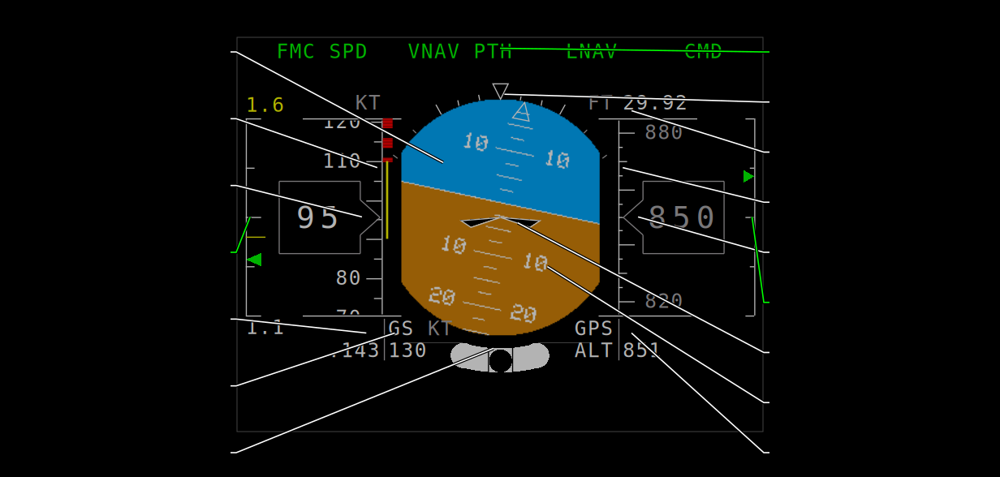
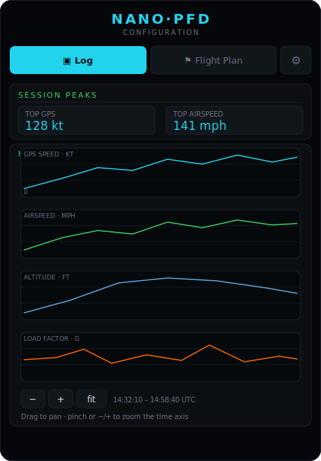
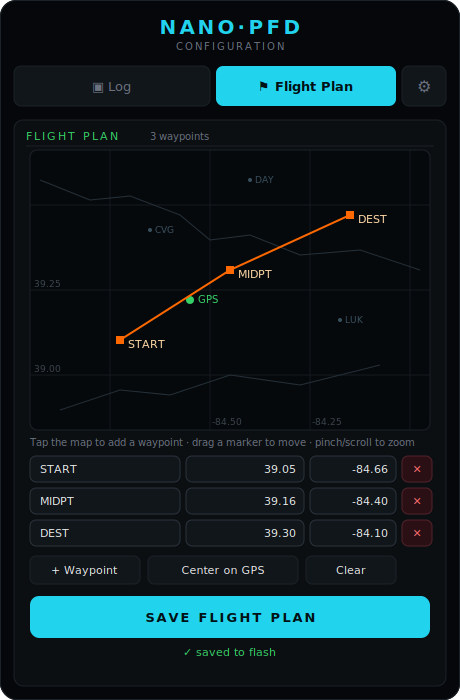
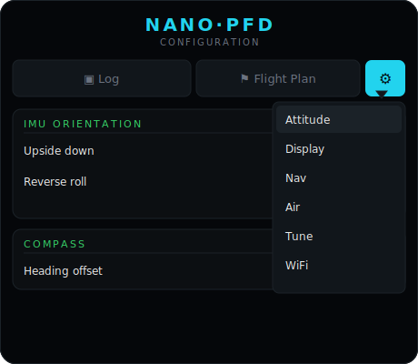
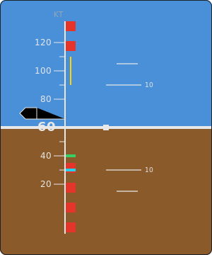
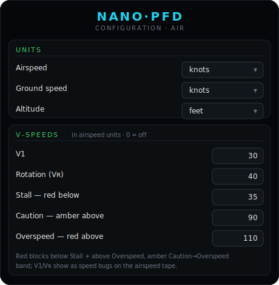

<div align="center">

# NanoPFD

**A pocket-sized glass cockpit — a Primary Flight Display + moving-map Navigation Display that runs on a single ESP32-S3 and a small Waveshare or LilyGO screen.**


<p align="center">
  <a href="https://www.paypal.com/donate/?business=D7CRFDQZ8LNKA&amp;no_recurring=0&amp;item_name=Pay+for+my+silly+projects&amp;currency_code=USD">
    
  </a>
</p>

<sub>NanoPFD is free &amp; open source. If it's useful or fun, <a href="https://www.paypal.com/donate/?business=D7CRFDQZ8LNKA&amp;no_recurring=0&amp;item_name=Pay+for+my+silly+projects&amp;currency_code=USD"><b>chip in via PayPal</b></a> to help fund more open hardware. 🙏</sub>

<p align="center">
  <a href="docs/CONFIG_PORTAL.md"></a>
</p>
<sub><b>Configure it, plan a route, and review your flight log from your phone</b> — no reflashing. See the <a href="docs/CONFIG_PORTAL.md"><b>Web Configurator Guide →</b></a></sub>

</div>

NanoPFD turns an inexpensive ESP32-S3 dev display and a handful of I²C sensors into a self-contained
**EFIS** (Electronic Flight Instrument System): a real attitude indicator with airspeed and
altitude tapes on top, and a heading-up moving map of nearby airports, navaids and airspace
below — all rendered from scratch on the microcontroller, no PC or phone required.

> ⚠️ **Experimental / educational project.** NanoPFD is a hobby build, **not** a certified
> instrument. Do **not** rely on it for actual flight, navigation, or any safety-of-life use.

---

## What it shows

| Primary Flight Display | Navigation Display |
|:---:|:---:|
|  |  |

**PFD** — sky/ground attitude with a pitch ladder and bank scale, a fixed aircraft reference,
roll-stabilised airspeed (left) and altitude (right) tapes, digital heading, vertical-speed
indicator, a g-meter, and a turn-coordinator with slip/skid ball.

**ND** — a heading-up compass rose over a moving map: towered/non-towered airports, navaids,
runways, Class B/D and restricted airspace rings, rivers, coastlines, roads and state lines,
with decluttered labels — all centered on the live GPS position (with the last fix saved to
flash so it persists across power cycles).

On the single-screen boards both stack into one portrait panel (PFD on top, ND below); on the
dual-display board they drive two separate screens.

---

## One screen or two

The same renderer drives either a **single combined panel** or **two separate displays** —
just pick the board in [`config.h`](config.h):

<table>
<tr>
<td align="center" width="34%"></td>
<td align="center" width="66%"></td>
</tr>
<tr>
<td align="center"><sub><b>Single panel</b> — BOARD_D <i>(recommended)</i> / BOARD_C<br/>PFD over ND on one screen</sub></td>
<td align="center"><sub><b>Dual display</b> — BOARD_A<br/>PFD + ND on two 1.69″ screens (or PFD only)</sub></td>
</tr>
</table>

---

## Reading the Primary Flight Display

The PFD is the standard "six-pack-in-glass" attitude display. Everything is laid out the way a
real EFIS is — speed on the left, altitude on the right, attitude in the middle:

<div align="center">

</div>

**Attitude (centre)**

| Element | Looks like | Meaning |
|---|---|---|
| Artificial horizon | blue sky over brown ground | pitch & roll attitude; the split is the horizon line |
| Pitch ladder | white rungs every few degrees | climb / dive angle against the horizon |
| Bank scale & roll pointer | ticks around the top arc + a sky pointer | bank angle (marks at 10/20/30/45/60°) |
| Aircraft reference | fixed white "W" wings at the centre | your aircraft — the horizon moves behind it |
| Turn coordinator & slip-skid ball | curved scale + ball at the bottom | rate of turn and whether the turn is coordinated (ball centred = balanced) |
| Flight-mode annunciations | green text across the top | active autoflight modes (demo placeholder) |

**Speed & altitude (the tapes)**

| Element | Looks like | Meaning |
|---|---|---|
| Airspeed tape | rolling scale, left | indicated airspeed (kt), centred on the boxed readout |
| Airspeed readout | boxed number on the tape | current IAS |
| Mach number | small `.NNN` below the tape | indicated Mach |
| Ground speed | `GS` + number below the tape | GPS ground speed (kt) |
| Altitude tape | rolling scale, right | barometric (pressure) altitude (ft) |
| Altitude readout | boxed number on the tape | current baro altitude |
| Altimeter setting | white `NN.NN` above the tape | the Kollsman / QNH setting (inHg) — see [Setting the altimeter](#setting-the-altimeter-local-pressure) |
| GPS altitude | `GPS / ALT` + number below the tape | GPS (geometric) altitude, for comparison with baro |

**Rate & load (the edge bars)**

| Element | Looks like | Meaning |
|---|---|---|
| Vertical-speed indicator | green pointer on the far-right bar | climb / descent rate (centre = level) |
| G-meter | green pointer on the far-left bar | current load factor; a yellow (red if over-scale) marker holds the peak g |

> On the single-screen boards the heading/compass lives on the ND directly below, so the PFD
> drops its own bottom heading arc to make room. On the dual-display board the PFD keeps a
> heading arc along its bottom edge.

---

## Reading the Navigation Display

The ND is a heading-up moving map. Every element is colour- and shape-coded the way a real
chart / EFIS is — here is everything on it (the picture is the actual rendered display over a
real map of the Philadelphia area, where the Delaware River doubles as the PA/NJ state line):

<div align="center">

</div>

**Compass &amp; own-ship**

| Element | Looks like | Meaning |
|---|---|---|
| Heading readout | white digits in a box (top) | current magnetic heading, tilt-compensated |
| Compass card | white ring, ticks every 5°, numbers every 30° | rotates so your heading is always **up** (heading-up) |
| Own-aircraft symbol | white triangle, fixed at the centre | you — the map moves underneath |
| Heading reference | magenta line up the middle | where the nose points (always straight up) |
| Ground track | white line from the aircraft to the rim | your actual course over the ground (differs from heading in a crosswind) |
| Bearing to home | green line + green dot | direction and range back to the saved home / takeoff point |
| Range rings | grey dotted rings at ¼ ½ ¾ | distance scale; the outer white ring is the selected map range |
| Remote ID traffic | orange dot + altitude in feet | a nearby aircraft/drone broadcasting FAA Remote ID — its position and altitude (Remote ID is capped at 400 ft AGL), **received live over Bluetooth + WiFi** (see below) |

**Airports &amp; navaids**

| Symbol | Looks like | Meaning |
|---|---|---|
| Towered airport | blue ○ with a centre dot | controlled field (has a control tower) |
| Non-towered airport | magenta ○ with a centre dot | uncontrolled field |
| Closed airfield | grey ✕ | decommissioned / abandoned |
| VOR / navaid | blue ◇ diamond | radio navigation aid |
| City / landmark | yellow ▪ square | town or reference point |
| Runway | short white line | drawn at the true runway heading |

**Airport &amp; airspace rings — the colour is the size / status**

| Ring colour | Meaning |
|---|---|
| Cyan | large airport |
| Green | medium airport |
| Yellow | small airport |
| Grey | closed airport |
| Red | restricted / prohibited airspace |

**Map geography**

| Line | Colour &amp; style |
|---|---|
| River / lake shore | light blue, solid |
| Coastline &amp; country border | tan, solid |
| Road / interstate / highway | dark grey, solid |
| State line | grey, dashed |
| Glide path | yellow, dashed |

**Text labels** — airport / navaid id with a grey frequency line below it (blue for towered
fields &amp; navaids, magenta for non-towered, grey for closed); city names in yellow; road
names in white.

**Status &amp; warnings (corners)**

| Indicator | Meaning |
|---|---|
| `lat / lon` (bottom) | map-centre position — **green** with a GPS fix, **grey** when coasting on the last fix |
| Range / zoom (top-left, grey) | the selected map range = the outer-ring radius (e.g. `16NM`); **pinch / tap to zoom**. Turns **orange** in field mode |
| Battery voltage (top-right) | pack voltage — grey, turns **red** below 3.1 V |
| `SAT n` (top-right, yellow) | shown only when fewer than 5 satellites are tracked |
| `PROXIMITY` (top-left, **orange**) | at least one aircraft/drone broadcasting Remote ID is being tracked nearby — same colour as the traffic dots |
| `GPS LOST` box (grey, red outline) | the GPS fix was lost — the map freezes at the last known position (saved to flash, so it survives a power cycle) |

---

## Setting the altimeter (local pressure)

The altitude tape on the PFD shows **pressure altitude** — it reads the barometer against a
reference sea-level pressure. That reference (the **Kollsman / QNH** setting) changes with the
weather, so you set it to the local altimeter setting (from ATIS/AWOS or a nearby field) to make
the tape read true field elevation. The current setting is shown **above the altitude tape**, in
white, in inches of mercury — e.g. `29.92`. Just below the tape, the GPS altitude (`GPS / ALT`)
is shown for comparison.

Adjust it with the **`IO0` / `BOOT` button** on the side of the board — the same button on all
three builds (BOARD_A / BOARD_C / BOARD_D):

| Action | Effect |
|---|---|
| **Tap** | +0.01 inHg per press |
| **Hold** (> ~0.45 s) | scrolls up continuously (~11 steps/sec) for quick changes |

It's a single button, so it only counts **up**: the range is **28.00 – 31.00 inHg** and it
**wraps** from 31.00 back to 28.00, so you can keep tapping past the top to reach a lower value.
The default is **29.92 inHg** (standard pressure, 1013.25 hPa).

Your setting is **saved to flash** about 1.5 s after you stop adjusting (the delay coalesces a
long scroll into a single write), so it is **restored on the next power-up**.

> The setting feeds the pressure-altitude calculation in [`ASI.ino`](ASI.ino) (`inHg × 33.8639` →
> hPa); the range and default live in [`config.h`](config.h) (`BARO_MIN_INHG` / `BARO_MAX_INHG`).

---

## Hardware

NanoPFD builds for three display configurations — pick one in [`config.h`](config.h) (set
exactly one of `BOARD_A` / `BOARD_C` / `BOARD_D` to `1`). All three use an ESP32-S3 with
**8 MB octal PSRAM + 16 MB flash** and the **same set of sensors**; only the screen(s) differ.

| Build | Display / MCU | Interface | Layout | Typical FPS |
|---|---|---|---|---|
| **BOARD_D** *(recommended)* | [LilyGO T4-S3](https://amzn.to/3T65cXc) — 2.41″ 450×600 AMOLED (RM690B0) | QSPI | PFD + ND on one panel | ≈20 |
| **BOARD_A** *(recommended — small builds)* | [Waveshare ESP32-S3-LCD-1.69](https://amzn.to/4g6EG9R) (MCU + PFD, 240×280 ST7789) **+** *(optional)* [Waveshare 1.69″ LCD Module](https://amzn.to/4gbLXVY) (ND, ST7789V2) | dual SPI | PFD + ND on two screens (or **PFD only** — drop the 2nd screen) | PFD ≈38 / ND ≈14 |
| **BOARD_C** | [Waveshare ESP32-S3-Touch-LCD-2.8B](https://amzn.to/4f8DstD) — 480×640 IPS (ST7701S) | RGB-parallel (LCD_CAM) | PFD + ND on one panel | ≈13 |

**Which to pick:**
- **BOARD_D** *(recommended)* — the **bright AMOLED** + **QSPI** path give it the best contrast/visibility and the highest, smoothest frame rate. The default for most builds.
- **BOARD_A** *(equally recommended, smaller)* — a compact dual-1.69″ build with the fastest PFD. Great when size matters, and you can **leave off the ND screen** for a **PFD-only** instrument (set `ENABLE_NAV_DISPLAY 0` in [`config.h`](config.h) and just run the one onboard screen).
- **BOARD_C** — a fine all-in-one touch panel, but the IPS LCD is the **dimmest** and its RGB-parallel pipeline runs at the **lowest fps**, so reach for D or A first.

### Bill of materials

The **sensors are identical on every build** (all I²C / Qwiic, except the GPS, which is UART):

| Part | Role on the display | Buy on Amazon |
|---|---|---|
| **GY-912** — ICM-20948 + BMP388 combo | one board doing **both** the IMU *and* the barometer (recommended); auto-detected at runtime | [GY-912 10DOF](https://amzn.to/4wf9Ksz) |
| *(or)* **BNO085** — 9-DOF fusion IMU | attitude (sky/ground), tilt-compensated heading, g-meter, turn coordinator | [BNO085 module](https://amzn.to/4gcoOTd) |
| *(+ if using the BNO085)* **BMP390** — barometer | pressure altitude tape + vertical-speed indicator | [BMP390 sensor](https://amzn.to/4vulCHk) |
| **MS4525DO** airspeed (Matek ASPD-4525-class) | airspeed tape — **kit includes the pitot tube, tubing &amp; cable** | [MS4525DO + pitot kit](https://amzn.to/4aYrErr) |
| **Matek SAM-M10Q** — u-blox M10 GPS (**UART**) | ND map centre, ground speed, ground track, lat/lon — JST-GH **UART** (the firmware talks UBX over a serial port, not I²C) | [Matek SAM-M10Q](https://amzn.to/4vCDAHS) |
| Qwiic / STEMMA-QT cables + jumper wire | wiring the I²C bus + GPS UART | [Qwiic cable kit](https://amzn.to/4oS9q0x) |

**…plus exactly one display configuration from the table above.**

> 🔗 **Affiliate disclosure:** the product links in the two tables above are **Amazon affiliate
> links**. As an Amazon Associate I earn from qualifying purchases — it costs you nothing extra and
> helps fund the project. ❤️ Thank you! *(Generic-module listings change sellers often, so
> double-check the board matches before buying.)*

> 💡 **The IMU is auto-detected at runtime** (`IMU.ino`), and every option shares the one I²C
> bus: it uses a **BNO085** (0x4A) if present, else an **ICM-20948** (0x68/0x69 — e.g. the
> **GY-912**, via a self-contained register driver in [`ICM.ino`](ICM.ino) with host-side
> accel+gyro fusion and a tilt-compensated magnetometer heading), else the **QMI8658** (0x6B)
> that the Waveshare 1.69 / 2.8B boards carry onboard. The QMI8658 has no magnetometer (heading
> freezes), so for a full moving map use a BNO085 or a GY-912. The barometer is the same story —
> a **BMP390** (0x77) or the GY-912's **BMP388** (0x76) both work.

> ⚠️ The GY-912 axis/heading mapping in [`ICM.ino`](ICM.ino) is a sensible default but is
> mounting-dependent — if the horizon, turn coordinator, or compass read inverted/rotated on
> your build, flip the marked sign(s) there and tune `ICM_HEADING_SIGN` / `ICM_HEADING_OFFSET`
> in [`config.h`](config.h).

---

## How it works

NanoPFD is a from-scratch renderer tuned to squeeze a smooth glass cockpit out of a tiny MCU.

- **8-bit indexed canvases.** Everything draws into `GFXcanvas8`/`MyCanvas8` buffers using a
  12-entry colour palette ([`color_index[]`](InstrumentPanel.ino)) — half the memory of RGB565,
  and the per-board conversion to the panel's real format is cheap.
- **Two-core pipeline (FreeRTOS).** A sensor task publishes a lock-protected `state` snapshot;
  the PFD and ND draw + push their pixels in parallel on separate cores, double-buffered so the
  draw of one frame overlaps the transfer of the previous one.
- **A render path per panel kind:**
  - *SPI (BOARD_A)* — index→RGB565 converted on the fly during a DMA blit to each ST7789.
  - *RGB-parallel (BOARD_C)* — composited into a 600 KB RGB565 framebuffer that the S3's
    **LCD_CAM** peripheral scans out to the panel continuously.
  - *QSPI (BOARD_D)* — a self-contained RM690B0 driver pushes **RGB332** (1 byte/pixel) with a
    **per-line RLE codec** ([`RLE332.h`](RLE332.h), word-at-a-time run detection) so the frame
    compresses ~10× before the QSPI transfer.
- **Auto-generated aeronautical map (per-LOD pyramid).**
  [`tools/build_chart_data.py`](tools/build_chart_data.py) fetches OurAirports + Natural Earth +
  OSM data and emits [`chart_data.h`](chart_data.h) as a **pyramid of independent datasets** — one
  per zoom level (`gMapLod`), each with its own feature set *and* its own simplification, so the
  national view stays clean while the close-in view is dense. Oceans and lakes are emitted as
  closed rings and **scanline-filled** (with white coastlines); the renderer projects everything
  **azimuthal-equidistant** (a tangent plane, so the distance rings stay true), rotates it
  heading-up, and clips it to the compass circle.
- **Log-cheap map culling (flat per-LOD grid).** Each LOD's points / rings / runways are sorted
  into a 2-D grid whose cell width matches that level's view radius, with a cell→index offset
  table ([`chart_cull.h`](chart_cull.h)). A frame addresses the handful of cells under the visible
  circle directly — **O(on-screen features)** — instead of scanning a country-wide latitude strip,
  so the frame rate tracks what's actually drawn, not the size of the dataset.
- **Fresh sensor data.** The IMU FIFO is drained every loop, so attitude is always the latest
  sample — the sensors publish at **~380 Hz**, far above any display's frame rate.
- **Remote ID traffic awareness.** The ESP32-S3's otherwise-idle WiFi + Bluetooth radios run a
  passive [**FAA Remote ID / OpenDroneID**](https://github.com/opendroneid/specs) receiver
  ([`RemoteID.cpp`](RemoteID.cpp)): a continuous NimBLE advertisement scan plus a channel-hopping
  WiFi-beacon sniffer (promiscuous mode), both decoding the ASTM F3411 Location message. Nearby
  drones broadcasting Remote ID show up on the ND as orange dots with their altitude, and the
  orange `PROXIMITY` flag lights as soon as any target is heard. It's unobtrusive — parsing
  happens in the radio callbacks and a tiny low-priority task hops WiFi channels, so it doesn't
  steal time from rendering. (The ESP32-S3 Arduino core's NimBLE host is built **without** BLE 5
  extended advertising, so the Bluetooth side is **BT4-legacy only** — drones that broadcast
  *solely* over Bluetooth 5 Long-Range are caught over WiFi instead. WiFi NaN isn't decoded yet.
  Set `RID_DEBUG 1` in `config.h` for a per-second serial line showing what each radio hears.)

---

## Building & flashing

NanoPFD builds with [`arduino-cli`](https://arduino.github.io/arduino-cli/) and the Espressif
ESP32 core. **Octal PSRAM must be enabled** (`PSRAM=opi`). **Use core `3.3.6`** if you want the
Bluetooth Remote ID receiver: cores `3.3.7`–`3.3.10` have a regression that panics ESP32-S3 BLE
startup ([arduino-esp32 #12357](https://github.com/espressif/arduino-esp32/issues/12357)) — WiFi
is unaffected, but BLE won't initialize. `build.sh` warns if the wrong core is installed.

```bash
# 1. ESP32 core — pin 3.3.6 (3.3.7+ breaks ESP32-S3 BLE; see above)
arduino-cli core install esp32:esp32@3.3.6

# 2. Libraries
arduino-cli lib install "Adafruit BNO08x" "Adafruit BMP3XX Library" \
  "Adafruit GPS Library" "Adafruit GFX Library" "Adafruit BusIO" \
  "Adafruit Unified Sensor" "SparkFun 9DoF IMU Breakout - ICM 20948 - Arduino Library"
# Displays: GFX Library for Arduino (moononournation/Arduino_GFX)
arduino-cli lib install "GFX Library for Arduino"

# 3. Pick your board in config.h  (set exactly one of BOARD_A / BOARD_C / BOARD_D to 1)

# 4. Compile + upload
arduino-cli compile --upload \
  --fqbn "esp32:esp32:esp32s3:PSRAM=opi,FlashSize=16M" \
  --port /dev/cu.usbmodemXXXX .
```

A convenience wrapper, [`build.sh`](build.sh), reproduces the author's exact toolchain (a pinned
Arduino_GFX clone + isolated library set) and flashes in one step:

```bash
./build.sh /dev/cu.usbmodemXXXX
```

To regenerate the map for your area:

```bash
python3 tools/build_chart_data.py --lat 39.10 --lon -84.51 --radius-km 120
```

---

## 📱 Web configurator, flight planner & log

NanoPFD serves a **web app** over its own Wi-Fi AP — configure it, **plan a route**, and review
your **flight log** from your phone, with **no reflashing**. It's **always on**: the AP network
**`NanoPFD`** is always up at `http://192.168.4.1` (no mode switching), running alongside the
full-rate display and both Remote ID receivers.

<table>
<tr>
<td align="center" width="33%"><a href="docs/CONFIG_PORTAL.md"></a></td>
<td align="center" width="34%"><a href="docs/CONFIG_PORTAL.md"></a></td>
<td align="center" width="33%"><a href="docs/CONFIG_PORTAL.md"></a></td>
</tr>
<tr>
<td align="center"><sub><b>Log</b> — four per-metric plots, pinch-zoom, actual-time axis, CSV</sub></td>
<td align="center"><sub><b>Flight Plan</b> — tap/drag a route on a zoomable map → yellow route on the ND</sub></td>
<td align="center"><sub><b>⚙ Settings</b> — orientation, palette, map zoom, pressure, tuning, Wi-Fi</sub></td>
</tr>
</table>

- **Flight plan** — add named waypoints by tapping a zoomable map (or by lat/lon), drag them to
  shape the route, and **Save**. It persists to flash and draws on the ND as a **solid yellow
  line + marker + name** at each waypoint, heading-up over the moving map.
- **Log** — GPS speed, airspeed, altitude, and g recorded at 10 Hz for the last 30 min; four
  stacked per-metric plots with pinch-zoom and a real UTC time axis; CSV download. Survives power
  cycles.
- **Settings** (⚙ dropdown) — IMU orientation + *mount-at-any-angle* trim, per-color palette,
  map zoom, local pressure, smoothing/scales, Remote ID toggles + AP password, plus:
  - **Units** — pick knots / mph / km-h for airspeed & ground speed, and feet / meters for altitude.
  - **V-speeds** — 737-style airspeed-tape markers (V1, Vʀ, stall, caution, overspeed): red warning
    blocks + amber caution bands + speed bugs.
  - **Minimap zoom** — opt-in deep "field" zoom levels (range readout turns orange).

<table>
<tr>
<td align="center" width="42%"></td>
<td align="center" width="58%"></td>
</tr>
<tr>
<td align="center"><sub>V-speed markers on the airspeed tape</sub></td>
<td align="center"><sub>Units + V-speeds on the <b>Air</b> tab</sub></td>
</tr>
</table>

<p align="center"><b>→ Full walkthrough with screenshots: <a href="docs/CONFIG_PORTAL.md">docs/CONFIG_PORTAL.md</a></b></p>

## Configuration

Most settings are now editable at runtime in the [config portal](docs/CONFIG_PORTAL.md) (above).
The remaining **build-time** knobs live in [`config.h`](config.h):

- **Board select** — `BOARD_A` / `BOARD_C` / `BOARD_D` (exactly one = 1).
- **Pins** — display, I²C, and GPS UART pins per board.
- **`MAP_RANGE_M`** — the *default* moving-map range (center → radar edge) at boot; on the touch
  boards you then **pinch / tap to zoom** through the LOD pyramid live (see [`map_zoom.cpp`](map_zoom.cpp)).
- **`MAP_DEFAULT_LAT/LON`** — fallback map center when GPS is lost (and no saved fix exists).
- SPI clocks, layout offsets, task priorities/cores — and the power-on **defaults** for the
  runtime settings.

---

## Repository layout

```
InstrumentPanel.ino     entry point: tasks, shared state, colour palette, telemetry
config.h                board selection, pins, layout, tuning
instrument_drawer.ino   the PFD + ND renderers (drawHorizonDisplay / drawNavigationDisplay)
IMU.ino  GPS.ino  ASI.ino  ICM.ino    sensor drivers + fusion
CombinedDisplay.ino       BOARD_C  — ST7701S RGB panel (LCD_CAM)
CombinedDisplayAmoled.ino BOARD_D  — RM690B0 QSPI AMOLED (self-contained driver)
Touch.cpp  Touch.h       touch drivers (GT911 / CST226) + tap/pinch zoom
map_zoom.cpp  map_zoom.h  zoom ladder: range → LOD selection, field mode
MyCanvas8.h  RLE332.h  layout.h  State.h    rendering primitives + helpers
chart_data.h            generated aeronautical chart data (per-LOD pyramid)
chart_cull.h            flat per-LOD grid cull (cell → feature-index lookup)
tools/build_chart_data.py    map data generator (OurAirports + Natural Earth + OSM)
tools/svggen/           regenerates docs/*.svg by running the real renderer on the host
tests/                  host unit tests (layout math, RLE codec)
docs/                   the SVG illustrations in this README (generated, not hand-drawn)
```

> The README illustrations are produced by [`tools/svggen`](tools/svggen) — it compiles
> the actual PFD/ND drawers off-target against an SVG-recording canvas, so the pictures
> are exactly what the firmware renders. See [`tools/svggen/README.md`](tools/svggen/README.md).

---

<div align="center">
<sub>Built for the ESP32-S3 · rendered entirely on-device · <strong>experimental, not for real-world flight</strong></sub>
</div>
