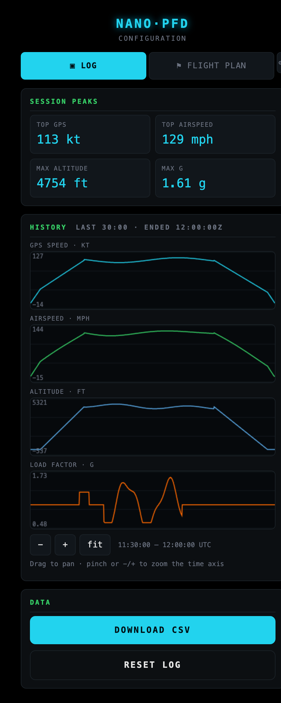
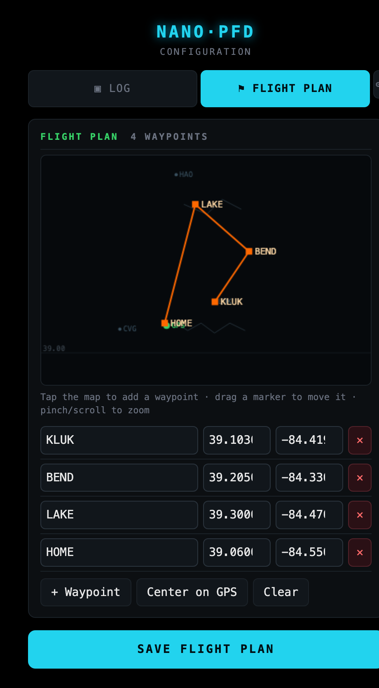
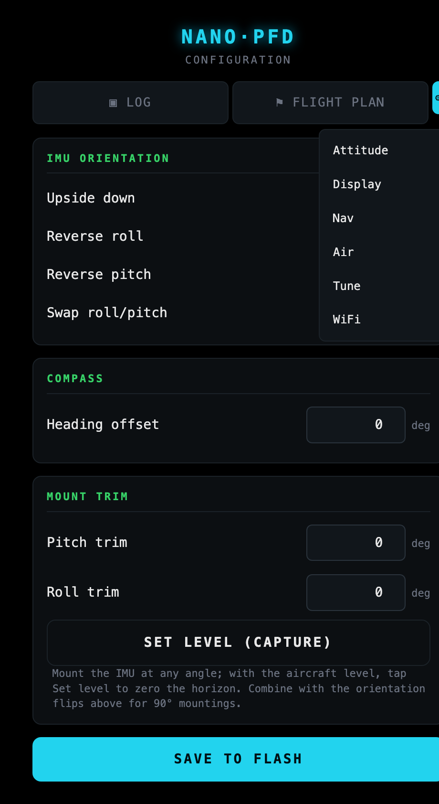
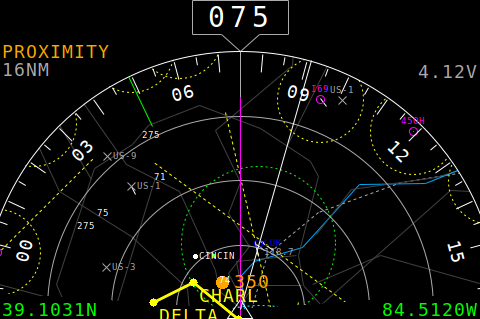
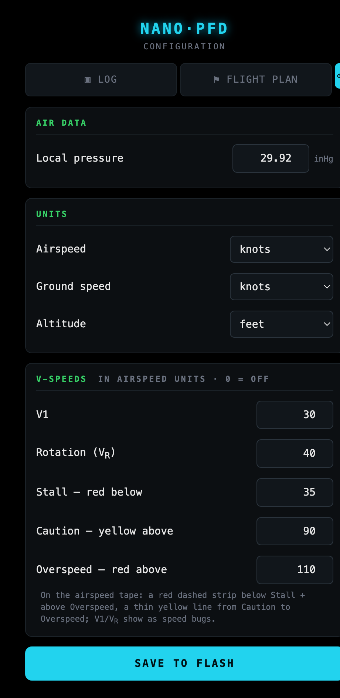

# NanoPFD config portal & flight log

NanoPFD has a built-in Wi-Fi **config portal** — a small web page served from the device — so
you can change settings, plan a route, and review a flight log from your phone, with **no
reflashing**. Join the **`NanoPFD`** Wi-Fi network and open `http://192.168.4.1`.

<table>
<tr>
<td align="center" width="33%"></td>
<td align="center" width="34%"></td>
<td align="center" width="33%"></td>
</tr>
<tr>
<td align="center"><b>Log</b> — four per-metric plots</td>
<td align="center"><b>Flight Plan</b> — map + waypoint list</td>
<td align="center"><b>⚙ Settings</b> dropdown</td>
</tr>
</table>

---

## One always-on mode

NanoPFD runs **everything at once, all the time** — the glass display (PFD + ND + sensors +
logging), the Wi-Fi AP + web portal, and **both** Remote ID receivers (BLE and Wi-Fi). There is
**no mode to switch**: the AP is always up and the portal is always reachable.

- **Wi-Fi RID** listens on the AP's channel (**6**, where Remote ID Wi-Fi beacons almost always
  are) since it can't channel-hop without dropping your phone. **BLE RID** scans at low duty so
  the AP keeps the radio responsive. Both plot drones as orange dots on the compass.
- The **WiFi** tab has a **Reboot** button (re-reads flash / recovers); both RID toggles also
  flip live.

---

## Connecting

1. On your phone, join the Wi-Fi network **`NanoPFD`** (it's always broadcasting).
   - It is an **open** network out of the box (the 7-character default password is below the
     WPA2 minimum). Set an 8–63 character password on the **WiFi** tab to switch it to WPA2.
2. A **captive portal** should pop the settings page automatically. If not, open
   **`http://192.168.4.1`** in a browser.

Only one phone connects at a time.

---

## Using the web configurator

The portal has two big primary tabs — **Log** (the landing page) and **Flight Plan** — the things
you touch often — plus a **⚙ Settings** dropdown for the occasional-use panes.

1. **Log** / **Flight Plan** are the large buttons across the top.
2. Tap **⚙** to open the settings menu: **Attitude**, **Display**, **Nav**, **Air**, **Tune**,
   **WiFi**. Pick one to open its pane.
3. Most settings **apply live** as you change them (you'll see the panel update). A few — the AP
   password and the Remote ID toggles — take effect after a reboot.
4. **SAVE TO FLASH** (shown on settings panes) persists everything across power cycles.

See [the settings tabs](#the-settings-tabs) for what each pane does.

## Flight plan

Build a route of named waypoints. It's saved to flash and drawn on the ND as a **solid yellow
line** with a **yellow marker + name** at each waypoint.

**On the map** (north-up, zoomable):
- **Tap** an empty spot to drop a waypoint there.
- **Drag** a marker to move it; **pinch** or **scroll-wheel** to zoom; **drag** empty space to pan.
- The **green dot** is your live GPS position; **Center on GPS** recenters on it.
- A coarse basemap (coastlines/borders + major airports) and a lat/lon grid give you context.

**In the list**, edit each waypoint's **name** (≤ 8 chars) and exact **lat/lon**, or tap **✕** to
delete it. **+ Waypoint** adds one at the map center; **Clear** removes all.

Then tap **SAVE FLIGHT PLAN** — it writes to flash, appears on the ND immediately, and survives
reboots. On the **ND**, the route overlays the moving map and rotates heading-up with everything else:

## The settings tabs

Most controls **apply live** — you'll see the panel change as you adjust them. A few are
**save-only** (they need a reboot): the AP password and the Remote ID toggles. **SAVE TO FLASH**
(shown on the settings panes) persists everything.

### Attitude
- **IMU orientation** — *Upside down*, *Reverse roll*, *Reverse pitch*, *Swap roll/pitch*. These
  handle the gross 90° mounting orientations. One setting drives whichever IMU is installed.
- **Heading offset** — rotates the compass so magnetic north lines up (0–359°). Default 0.
- **Mount trim** + **Set level** — see [Mounting the IMU at any angle](#mounting-the-imu-at-any-angle).

### Display
A color picker for each of the 15 palette entries (Sky, Ground, Traffic, Water, Roads, …). The
swatch is the chosen color; the panel updates instantly. *Note:* the LilyGO AMOLED (BOARD_D)
quantizes to 8-bit color, so its on-screen shade is coarser than the picker (most visible on blues).

### Nav
- **Map zoom** — sets the moving-map range (same ladder as the on-screen pinch/tap zoom).
- **Minimap zoom** — off by default. You can always pinch/tap zoom the full range (down to
  ~125 m). This toggle controls the **magnified field basemap** at those deep zooms: **off** = the
  deep zoom just shows the real close-in view (range rings, own-ship and nearby traffic up close)
  with the plain chart; **on** = the deep zoom magnifies a **field/minimap basemap** (~8 km around
  a frozen point) for geographic context, and the corner **range readout turns orange**.

### Air
- **Local pressure** — the altimeter (Kollsman) setting in inHg, 28.00–31.00.
- **Units** and **V-speeds** — see [Units & V-speeds](#units--v-speeds) below.

## Units & V-speeds

**Units** (Air tab) — choose the readout units independently:
- **Airspeed** and **Ground speed**: knots / mph / km-h.
- **Altitude**: feet / meters.

The tapes, the GS readout and their tick scales all follow your choice, with a small unit label at
the top of each tape. *(Airspeed indication works even if the barometer is absent — it falls back
to standard sea-level air density, which is the reference for indicated airspeed anyway.)*

**V-speeds** (Air tab) — reference speeds drawn on the airspeed tape, 737-style. Enter them in the
current airspeed unit (0 = off):

- **Stall** / **Overspeed** — a **red dashed strip** (a vertical run of red squares) below Stall and
  above Overspeed.
- **Caution** — a thin **yellow** vertical line from Caution up to Overspeed, centred in the strip
  (2 px on the single/combined panels, 1 px on the dual display).
- **V1** and **Vʀ** (rotation) — cyan/green **speed bugs**, the strip's width, drawn on top.

They all move with the tape, on a thin strip just right of the airspeed line that clears the
bank-angle scale.

### Tune
Runtime tuning, no reflash:
- **Smoothing** (0–1, smaller = smoother but slower): attitude, g-force, altitude, vertical speed,
  airspeed.
- **Instrument scales**: VSI full-scale (ft/s) and g-meter full-scale (g).

### Log
The flight logger — see [Flight log](#flight-log).

### WiFi
- **Remote ID receiver** — enable/disable **Bluetooth LE** and **WiFi** drone detection (see
  [Remote ID](#remote-id)). *Toggles apply live; both default on at every boot.*
- **AP password** — 8–63 chars for WPA2; shorter runs the AP open. *Applies after a reboot.*

---

## Mounting the IMU at any angle

You don't have to mount the IMU square to the airframe:

1. On the **Attitude** tab, set the orientation flips so the horizon moves the right way (sky up,
   bank/pitch in the correct direction). These cover the 90°-step orientations.
2. Mount the device however it fits. With the **aircraft level**, tap **SET LEVEL (CAPTURE)** —
   this records the current tilt as *level* (into Pitch trim / Roll trim) so the horizon reads flat.
3. Fine-tune **Pitch trim** / **Roll trim** by hand if needed.
4. Set the **Heading offset** so the compass points north.

Trims default to 0 (no change), so an already-square mount needs nothing here.

---

## Remote ID

NanoPFD passively receives FAA Remote ID / OpenDroneID broadcasts and plots nearby drones as
orange dots (with altitude) on the compass. Two radios, each independently toggleable on the
**WiFi** tab:

- **Bluetooth LE** — most consumer drones and standalone RID modules (BT4-legacy).
- **WiFi** — drones that beacon over WiFi.

Both run continuously alongside the AP and the display:

- **Bluetooth LE** scans at low duty so the AP keeps the radio responsive.
- **WiFi RID** rides the AP's radio on its channel (**6**, where Remote ID WiFi beacons almost
  always are — it can't channel-hop without dropping your phone). So it catches drones on channel 6.

Both toggles flip live and default on at every boot.

---

## Flight log

A circular buffer continuously records **GPS ground speed, indicated airspeed, MSL altitude, and
load factor (g)** at **10 Hz**, keeping the **last 30 minutes** (in PSRAM). It is saved to flash
on reboot and reloaded at boot, so a recorded flight survives a power cycle for later review.

On the **Log** tab:
- **Session peaks** — top GPS speed, top airspeed, max altitude, max g (since power-on / last reset).
- **History plots** — four stacked plots (GPS speed, airspeed, altitude, g), each on its own
  auto-scaled axis and sharing one time window. **Drag to pan**, **pinch** or **scroll** to zoom,
  or use **− / + / fit**. The x-axis reads actual UTC clock time once GPS time is acquired.
- **DOWNLOAD CSV** — the full 10 Hz log as `flightlog.csv` (`t_s,utc,gps_kt,asi_mph,alt_ft,g`).
- **RESET LOG** — clears the buffer and peaks.

To review a flight: land, join `NanoPFD` (always broadcasting), open the **Log** tab. The log
persists across power cycles, so you can also review it after the unit has been off.

---

## What you still need to reflash for

The portal covers runtime settings. **Hardware and structural options remain build-time** in
[`config.h`](../config.h) (change them and re-run `build.sh`):

- **Board select** (`BOARD_A` / `BOARD_C` / `BOARD_D`)
- **GPIO pins** (display, I²C, GPS UART) and **display/QSPI/RGB timing**
- **I²C bus clocks**, **FreeRTOS task cores / priorities / stacks**
- **Partition table** (`partitions.csv`), **Remote ID channel-dwell timing**
- The power-on **defaults** for the runtime settings (`ALPHA_*`, `VSI_FULL_SCALE`, `GMETER_FS`,
  `RID_USE_BLE/WIFI`, orientation, heading) — handy if you want a different out-of-box state.
